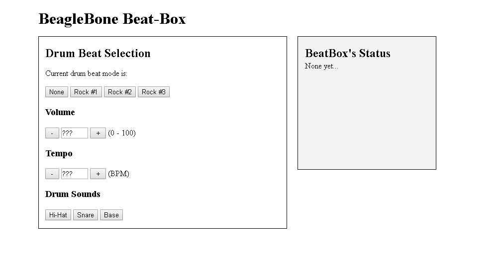

The purpose of this project is to create a micro-controller beatbox that creates and plays sounds on the fly.

The BeagleBone starts with 2 base drum beats and a base tempo and volume.
The user can change the drum beat by pressing the center joystick button. 
The volume is controlled by the up and down joystick buttons and tempo is controlled by left and right buttons.

To intialize on the fly sounds, the acceleromter is used. Forces in the Y orientation trigger the addition of a 
single Snare drum play to the current drum beat. Forces in the Y orientation trigger a Bass drum and forces in the Z
orientation trigger a Hihat drum.

Apart from controling the BeagleBone with manually, the user has a web interface which connects to the BeagleBone.

Interface:

